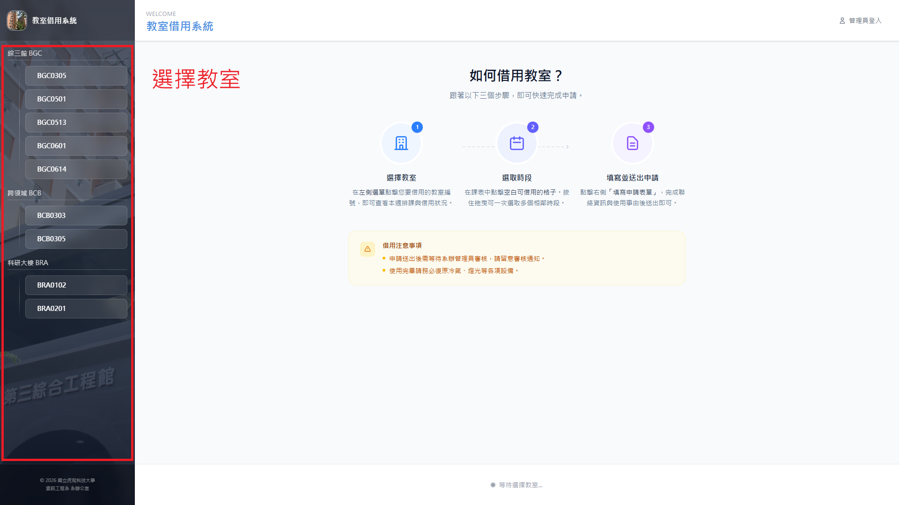
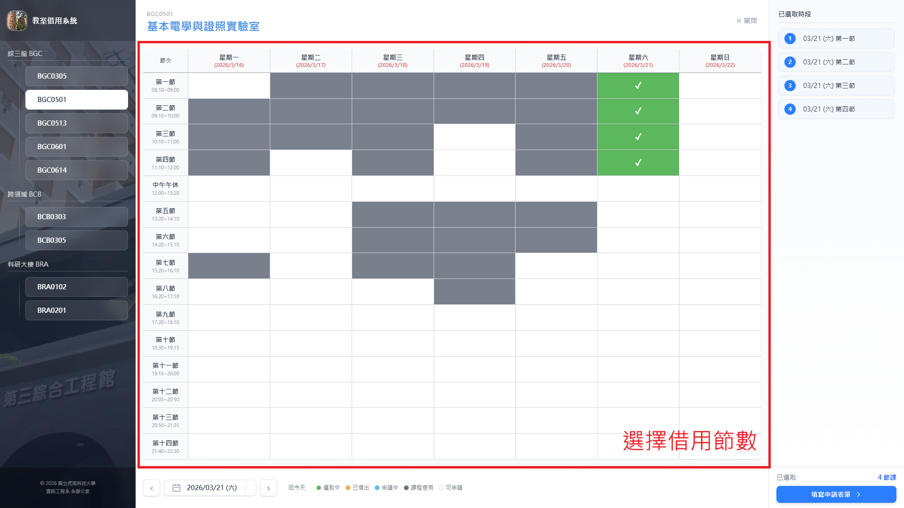
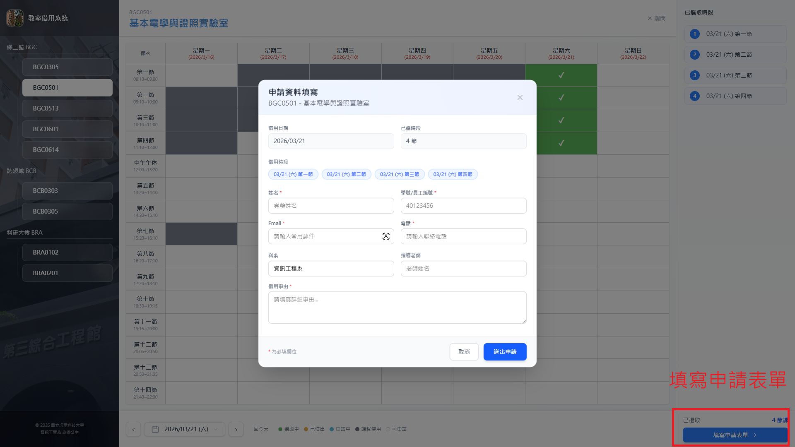

# 使用者借用流程

本系統提供一般使用者進行教室借用申請，流程採用線性三步驟：

1. 教室選擇
2. 節數選擇
3. 填寫表單

## 適用對象與權限

- 一般使用者可提出借用申請與取消自己的申請
- 審核、核准或駁回屬於管理員權限
- 若使用者被列入黑名單或停權中，將無法提出新申請

## 1. 進入系統

開啟系統首頁後，畫面會顯示可借用教室與借用流程區塊。

## 2. 選擇教室與日期

- 先選擇欲借用的教室
- 再選擇借用日期
- 系統會依照課表、既有借用與可借用規則顯示可選時段

若日期為不可借用日或時段已被占用，對應時段將無法勾選。

## 3. 選擇借用節數

- 於時段區塊勾選要借用的節數
- 可一次選擇多個連續或不連續節數

## 4. 填寫申請表單

請填寫以下資訊後送出：

- 申請人姓名
- 身分識別碼（學號或教職員編號）
- 聯絡信箱與電話
- 系所或單位
- 借用原因
- 指導老師（若有）

## 5. 送出後狀態

- 送出後，申請狀態為「待審核」
- 審核完成後，會依結果更新為「已核准」或「已駁回」
- 若申請者主動取消，狀態會更新為「已取消」

## 6. 取消申請

- 系統提供簽章安全連結進行取消
- 僅能取消尚未完成或仍可取消的申請
- 取消後將釋放原先占用的時段

## 常見注意事項

- 請確認填寫的聯絡資訊正確，避免通知無法送達
- 同一時段若已被他人借用，系統會阻擋重複申請
- 若系統顯示無可借用時段，請改選日期或其他教室
